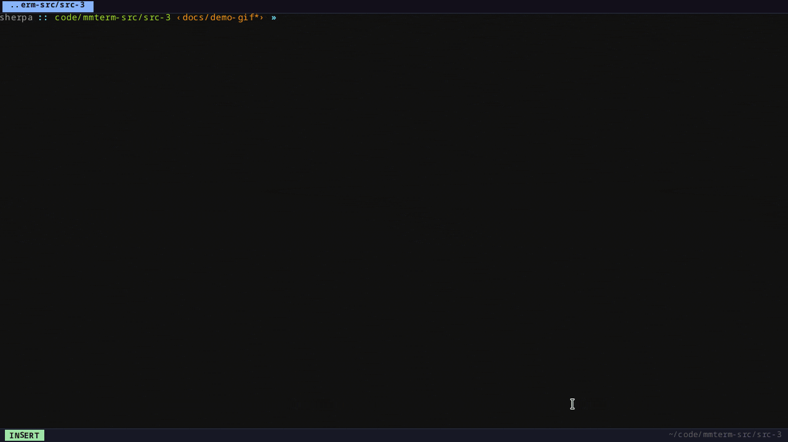

# mmterm


A cross-platform, GPU-free terminal emulator written in Rust with vim-style modal input, split panes, and multi-tab sessions.



Renders entirely via a CPU pixel buffer — no GPU, no OpenGL, no Vulkan.

## Features

- **Modal input** — Insert, Normal, Visual, and Search modes (vim-style)
- **Split panes** — binary-tree layout, horizontal and vertical splits; drag separators or use `Ctrl+Shift+Arrow` to resize
- **Multi-tab** — independent pane trees and font metrics per tab
- **Scrollback search** — live match highlighting across 10 000-line buffer; history navigable with ↑/↓, persisted to `~/.config/mmterm/search_history`
- **Themes** — 9 built-in themes; custom themes via `~/.config/mmterm/themes/`
- **OSC 8 hyperlinks** — clickable URLs rendered in the terminal
- **OSC 52 clipboard sync** — copy/paste over SSH without extra tools
- **Focus reporting** — `?1004h/l` sends `\e[I`/`\e[O` on window, tab, and pane focus changes; neovim `autoread` and tmux work correctly
- **DEC line drawing** — box-drawing characters for ncurses TUI apps (`dialog`, `nmtui`, `mutt`)
- **Pane zoom** — full-window focus for the active pane
- **Passthrough mode** — `Ctrl+B` forwards all keystrokes directly to the PTY, bypassing mmterm shortcuts; useful when running vim, tmux, or other apps that share keybindings; status bar shows `INSERT PASS`; press `Ctrl+B` again to exit
- **Session logging** — capture PTY output per-pane to `~/.mmterm/` with `Ctrl+Shift+L`
- **Color emoji** — rendered via FreeType CBDT/CBLC
- **Visual bell** — BEL (0x07) shows a `●` dot next to the mode badge in the status bar for 150 ms; a 500 ms cooldown prevents spam from tab-completion; an optional screen flash is available via `visual_bell = true` in `[general]`
- **Session persistence** — tabs, splits, and per-pane CWDs are saved on quit and restored on next launch; a centered dialog asks `[s] Save and quit / [q] Quit / [Esc] Cancel`; toggle with `restore_session` in `[general]`
- **Command palette** — `Ctrl+Shift+P` fuzzy-filter and run any action by name; shows the keyboard shortcut for each entry
- **TUI config editor** — edit settings in-process with `Ctrl+,`
- **Zero-config startup** — bundled JetBrains Mono fallback font (regular, bold, italic)

## Requirements

- Rust 1.85+ (edition 2024)
- Linux (X11 or Wayland) or macOS
- On Linux: a C toolchain and FreeType headers (`libfreetype-dev`)

## Build

```sh
cargo build --release
```

The binary is at `target/release/mmterm`.

## Install

### Quick install (recommended)

Download the prebuilt binary for your platform into `~/.local/bin`:

```sh
sh -c "$(curl -fsSL https://raw.githubusercontent.com/roramirez/mmterm/main/install.sh)"
```

Supported platforms: Linux x86_64, Linux aarch64, and macOS (Apple Silicon). The script
verifies the download's SHA-256 checksum before installing and, on Linux, adds an
application-menu entry. If `~/.local/bin` is not already on your `PATH`, the installer adds
it to your shell profile (`~/.zshrc` or `~/.bashrc`).

**Prefer to read before you run?**

```sh
curl -fsSL https://raw.githubusercontent.com/roramirez/mmterm/main/install.sh -o install.sh
less install.sh        # inspect
sh install.sh
```

Environment variables:

| Variable | Default | Effect |
|---|---|---|
| `MMTERM_BIN_DIR` | `~/.local/bin` | Install directory |
| `MMTERM_VERSION` | latest release | Pin a specific tag, e.g. `v0.5.0` |

### From source

Requires Rust 1.85+ (edition 2024). On Linux you also need a C toolchain and FreeType
headers (`libfreetype-dev`).

```sh
cargo install --git https://github.com/roramirez/mmterm
```

Or from a local checkout:

```sh
cargo install --path .
```

## Running

```sh
mmterm
```

Print version:

```sh
mmterm --version   # e.g. mmterm 0.3.0+abc1234 (local) or mmterm 0.3.0 (release)
```

Print help:

```sh
mmterm --help
```

Enable logging:

```sh
RUST_LOG=info mmterm
```

Enable debug logging to file:

```sh
mmterm --debug   # writes DEBUG-level logs to ~/.mmterm/debug-<timestamp>.log
```

## Configuration

On first run, a config file is created at:

- **Linux/macOS**: `$XDG_CONFIG_HOME/mmterm/config.toml` (defaults to `~/.config/mmterm/config.toml`)

```toml
[font]
family = "Noto Sans Mono"
size   = 16.0

[window]
width           = 800
height          = 600
title           = "mmterm"
cursor_blink_ms = 500

[shell]
# program = "/bin/zsh"   # defaults to $SHELL

[terminal]
scrollback_lines = 10000  # minimum 100

[logging]
auto_log = false          # start logging automatically for every new pane
log_dir  = ""             # destination directory (empty = ~/.mmterm)

[status_bar]
right = "%pwd  %date{%H:%M}"  # format string (%pwd = OSC 7 cwd, %date{fmt} = strftime)

[theme]
name = "default"          # see ~/.config/mmterm/themes/ for available themes

[colors]
background = "#121212"
foreground = "#a0a0a0"
cursor     = "#bbbbbb"
selection  = "#3d3d3d"
palette    = [ ... ]      # 16-color ANSI palette
```

You can also edit settings live with `Ctrl+,`.

## Key Bindings

### Global

| Binding | Action |
|---|---|
| `Ctrl+Q` | Quit — when `restore_session = true` shows save-session dialog; otherwise confirmation overlay when multiple tabs/panes are open |
| `Ctrl+Enter` | Toggle borderless fullscreen |
| `Ctrl+,` | Open config panel |
| `Ctrl+Shift+P` | Open command palette |
| `Ctrl+T` | New tab |
| `Ctrl+PageUp` / `Ctrl+PageDown` | Previous / next tab |
| `Ctrl+Shift+PageUp` / `Ctrl+Shift+PageDown` | Move tab left / right |
| `Ctrl+Shift+W` | Close tab |
| `Ctrl+Shift+R` | Rename tab |
| `Alt+1`..`Alt+9` | Jump to tab by position |
| `Ctrl++` / `Ctrl+=` | Increase font size (current tab) |
| `Ctrl+-` | Decrease font size (current tab) |
| `Ctrl+0` | Reset font size |
| `Ctrl+Shift+K` | Clear scrollback |
| `Ctrl+Shift+L` | Toggle session logging for active pane |

### Modes

| Binding | Action |
|---|---|
| `Ctrl+.` | Cycle Insert → Normal → Visual → Insert |
| `Ctrl+\` | Enter Normal mode |

### Panes (`Ctrl+W` prefix)

| Binding | Action |
|---|---|
| `Ctrl+W v` | Split horizontally |
| `Ctrl+W s` | Split vertically |
| `Ctrl+W a` | Auto-split (along longest dimension) |
| `Ctrl+W h/j/k/l` | Focus left / down / up / right |
| `Ctrl+W w` | Cycle focus |
| `Ctrl+W q` | Close pane |
| `Ctrl+W z` | Toggle pane zoom |
| `Ctrl+W p` | Enter screenshot mode |
| `Ctrl+Shift+←/→` | Grow/shrink active pane horizontally |
| `Ctrl+Shift+↑/↓` | Grow/shrink active pane vertically |
| drag separator | Drag the 1 px separator line to resize |

### Screenshot Mode (`Ctrl+W p`)

A rectangular selection overlay appears centered on the screen.

| Binding | Action |
|---|---|
| `←` / `→` / `↑` / `↓` | Move the selection |
| `Shift+→` / `Shift+←` | Grow / shrink the right edge |
| `Shift+↓` / `Shift+↑` | Grow / shrink the bottom edge |
| `Enter` / `Space` | Capture and save PNG |
| `Esc` | Cancel |

The file is saved as `mmterm-YYYYMMDDTHHMMSS.png` in the directory set by `[general] screenshot_dir` (default `~/mmterm/shot`). The full path is copied to the clipboard automatically after a successful capture.

### Visual Bell

BEL (0x07) — sent by the shell on tab-completion with multiple matches, by editors on invalid input, etc. — shows a yellow `●` dot next to the mode badge in the status bar for 150 ms. A 500 ms cooldown suppresses repeated bells so rapid sequences (e.g. pressing Tab twice) only flash once.

To also flash the screen background (Terminator-style), set `visual_bell = true` in `[general]`:

```toml
[general]
visual_bell = true   # default: false
```

### Scrollback

| Binding | Action |
|---|---|
| `Shift+PageUp` / `Shift+PageDown` | Scroll half screen |
| `Ctrl+Shift+Home` / `Ctrl+Shift+End` | Jump to top / bottom |

### Search (enter from Normal mode with `/`)

| Binding | Action |
|---|---|
| `/` | Open search |
| `Enter` | Next match |
| `↑` / `↓` | Navigate search history |
| `Ctrl+C` | Copy current match |
| `n` / `N` | Next / previous match (Normal mode) |
| `Escape` | Exit search |

### Normal Mode

| Binding | Action |
|---|---|
| `v` | Enter Visual mode |
| `i` / `Escape` | Return to Insert mode |
| `j` / `k` | Scroll down / up |
| `/` | Open search |
| `n` / `N` | Next / previous search match |

### Visual Mode

Navigate freely to position the cursor, press `v` to set the selection anchor, then move to the end and copy.

| Binding | Action |
|---|---|
| `h/j/k/l` or arrows | Move cursor (scrolls viewport at boundaries) |
| `w` / `b` / `e` | Forward word / backward word / end of word |
| `0` / `$` | Start / end of line |
| `g` / `G` | Top / bottom of viewport |
| `v` | Set selection anchor at cursor (starts highlighting) |
| `o` | Swap anchor and cursor |
| `y` / `Ctrl+C` | Copy selection and exit |
| `Y` | Yank (copy) the entire line at cursor |
| `q` / `Escape` | Exit to Insert mode |

### Clipboard

| Binding | Action |
|---|---|
| `Ctrl+Shift+C` | Copy selection |
| `Ctrl+Shift+V` | Paste |

## Architecture

```
main.rs (App, event loop)
├── input/      — key → Action mapping, modal state
├── pty/        — PTY fork, shell spawn, read/write
├── terminal/   — VT/ANSI parser, cell grid, scrollback
├── ui/         — binary-tree split layout, pane struct
├── renderer/   — CPU pixel rendering, glyph cache
├── config.rs   — TOML load/save
└── tui_config/ — in-process config editor
```

See [`doc/SPEC.md`](doc/SPEC.md) for the full architecture and feature specification.

## License

GPL-2.0 — see [LICENSE](LICENSE).
